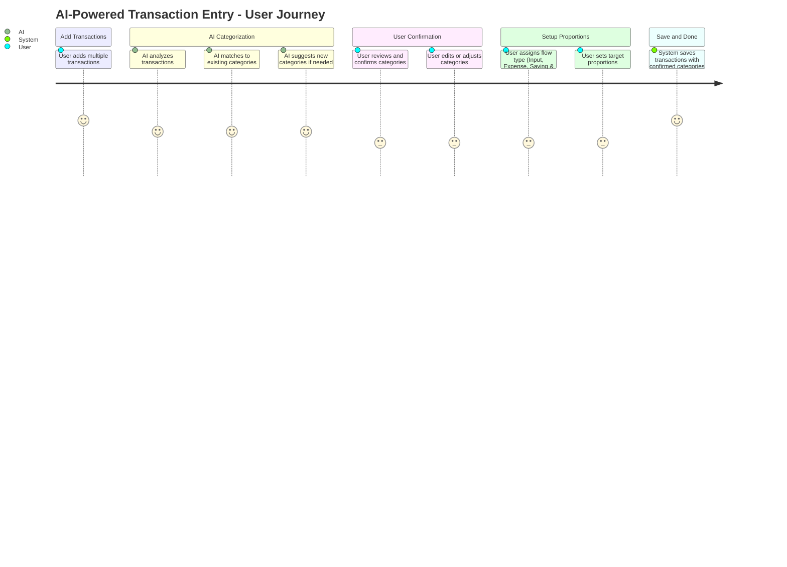

```mermaid
journey
    title AI-Powered Transaction Entry - User Journey
    section Add Transactions
      User adds multiple transactions: 5:User
    section AI Categorization
      AI analyzes transactions: 4:AI
      AI matches to existing categories: 4:AI
      AI suggests new categories if needed: 4:AI
    section User Confirmation
      User reviews and confirms categories: 3:User
      User edits or adjusts categories: 3:User
    section Setup Proportions
      User assigns flow type (Input, Expense, Saving & Investing): 3:User
      User sets target proportions: 3:User
    section Save and Done
      System saves transactions with confirmed categories and flows: 5:System
```
